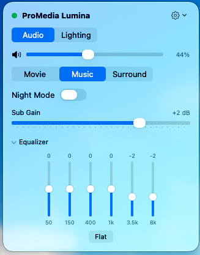
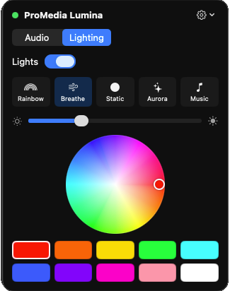

# Lumina — menu-bar control for Klipsch ProMedia Lumina 2.1

A lightweight macOS menu-bar app that controls **Klipsch ProMedia Lumina 2.1**
speakers over Bluetooth LE — volume, EQ, sound modes, subwoofer gain, and the
full RGB lighting system — from a small popover in your menu bar.

<p align="center">
  
  &nbsp;&nbsp;
  
</p>

Tweak the six-band EQ mid-song, drop the sub a few dB at night, dial in the
exact shade of red on the light ring, or switch on **Ambient** and let the
lights follow whatever is on your screen — all without reaching for your phone.
One click on the menu-bar icon and every control the speakers have is right
there, in a native app that feels at home on your Mac.

## What it does

Once connected, Lumina gives you a two-tab popover:

**Audio**
- **Volume** with a mute button
- **Sound modes** — Movie, Music, Virtual Surround
- **Night mode** on/off
- **Subwoofer gain** from −20 dB to +10 dB
- **6-band equalizer** (50 Hz · 150 Hz · 400 Hz · 1 kHz · 3.5 kHz · 8 kHz), each −6…+6 dB, with a **Flat** reset

**Lighting**
- **Lights** on/off (remembers your last mode)
- **Modes** — Rainbow, Breathe, Static, Aurora, Music React, and **Ambient**
- **Brightness** (Static, Breathe, and Ambient)
- **Static / Breathe** — color swatches plus a full color picker
- **Aurora** — Cool or Warm tone
- **Music React** — four gradient presets (Blue→Purple, Cyan→Blue, Red→Purple, Yellow→Orange)
- **Ambient** — the lights follow the colors on your screen, Ambilight-style
  (see [Ambient mode](#ambient-mode) below)

Changes you make on the speaker's control pod (like the brightness button) are
reflected back in the app automatically.

## Why it's needed

Klipsch ships control apps for **phones** (Klipsch Connect Plus) and for
**Windows** (Klipsch Control), but there is no native app for macOS — Mac users
otherwise can't adjust the speakers' EQ, sound modes, or lighting at all. Lumina
fills that gap and keeps everything a single click away in the menu bar.

The speakers accept only **one Bluetooth connection at a time**, so while Lumina
is connected your phone app can't be, and vice-versa. Lumina includes a
**Release to Phone App** menu item to hand the connection back without quitting.

## Requirements

- macOS 14 (Sonoma) or later
- A Mac with Bluetooth (Apple Silicon and Intel are both supported)

## Install

### Option 1 — download the release (easiest)

1. Download `Lumina-v1.0.0.zip` from the
   [v1.0.0 release](https://github.com/idlivada/klipsch-promedia-lumina-mac-app/releases/tag/v1.0.0)
   and unzip it.
2. Move `Lumina.app` wherever you like (e.g. your Applications folder).
3. The app is ad-hoc signed (not notarized), so macOS will warn you on first
   launch. Right-click `Lumina.app` → **Open** → **Open**, or run:
   ```sh
   xattr -dr com.apple.quarantine Lumina.app
   ```

### Option 2 — build from source

Requires the Xcode Command Line Tools (`xcode-select --install`).

```sh
git clone https://github.com/idlivada/klipsch-promedia-lumina-mac-app.git
cd klipsch-promedia-lumina-mac-app
./scripts/build.sh --open
```

`build.sh` compiles the app, bundles it as `build/Lumina.app`, code-signs it, and
(`--open`) launches it. To run it again later, just open `build/Lumina.app` or
drag it to your Applications folder.

By default the build is ad-hoc signed, which means macOS forgets the **Screen
Recording** permission (needed for Ambient) every time you rebuild. To avoid
that, create a signing certificate once: **Keychain Access → Certificate
Assistant → Create a Certificate…**, name it `Lumina Dev`, Identity Type
**Self-Signed Root**, Certificate Type **Code Signing**. `build.sh` uses it
automatically when present (or set `LUMINA_SIGN_ID` to use a different
identity).

### First launch

1. macOS will ask for **Bluetooth permission** — click **Allow**. (The app can't
   find the speakers without it.)
2. Make sure the **Klipsch phone app is closed** so the speakers are free to
   connect.
3. The status dot in the popover turns **green** when connected.
4. The first time you use **Ambient**, macOS asks for **Screen Recording**
   access — enable Lumina in System Settings, then click **Retry** (or relaunch).
   Lumina only samples a tiny, downscaled image of the screen to pick a color;
   nothing is recorded or stored.

The app lives only in the menu bar (no Dock icon). Quit it from the gear menu
inside the popover.

## Using it

- Click the **speaker icon** in the menu bar to open the popover.
- Switch between the **Audio** and **Lighting** tabs.
- The **gear menu** (top-right) has **Release to Phone App / Reconnect** and **Quit**.

### Ambient mode

Ambient turns the speakers into a bias light for your screen: the light ring
takes on the colors of whatever you're watching or working on, so the glow on
the wall looks like the picture continuing past the edges of your display.

**Turning it on:** open the **Lighting** tab and click **Ambient** (the display
icon at the end of the mode row). The first time, grant Screen Recording access
(see [First launch](#first-launch)). The panel shows a live swatch of the color
being sent and a status line — **Following your screen** means it's working.

**How the color is picked**
- **Edges count most.** Colors near the edges of the screen get the most
  weight, since that's where the light spills onto the wall. The center still
  counts, just less.
- **Letterbox bars are ignored.** Black bars above and below a movie (or at the
  sides) are detected and skipped, so a widescreen film is judged by the picture
  itself, not the bars.
- **Vivid colors win over gray.** Window chrome, text, and gray backgrounds
  count for little; the dominant hue on screen drives the lights. A mostly
  white or gray screen gives white light.
- **Always fully saturated.** Once a hue is picked, the lights show it at full
  saturation — screen colors are rarely pure, and a muted color looks washed
  out on LEDs. Only a genuinely white or gray result stays white.
- **Dark scenes stay dark — but colored.** A night scene with one bright object
  glows dimly in that object's color. A fully black screen turns the lights off.
- **Brightness follows the picture**, and the **Brightness** slider scales it
  on top.
- Changes are smoothed, and the lights settle on a new color in about half a
  second, so fast cuts blend rather than flicker.

**Good to know**
- **More than one display?** Use the **Display** picker in the Ambient panel to
  choose which screen the lights follow (the main display by default).
- **Keeping a color you like:** switch from Ambient to **Static** or **Breathe**
  and the color on screen at that moment becomes your Static/Breathe color.
- Ambient **pauses** while the lights are off, while the speakers are released
  to the phone app, or while disconnected, and picks up again automatically. It
  also stays on across restarts of the app.
- Choosing another mode — in the app, on the speaker's control pod, or in the
  phone app — ends Ambient.
- **Privacy:** Lumina samples a tiny, downscaled image of the screen (about
  64 × 36 pixels) only to compute a color. Nothing is saved, recorded, or sent
  anywhere except the resulting color to your speakers. Lumina's own popover is
  excluded from the sample.

### Notes

- **Brightness** is adjustable in **Static**, **Breathe**, and **Ambient** modes.
  Rainbow, Aurora, and Music React render their own colors on the speaker and
  can't be dimmed from a computer.
- If the app is stuck **Searching…**, close the Klipsch app on your phone — the
  speakers only allow one connection at a time.

## Troubleshooting

| Problem | Fix |
|---|---|
| Stays "Searching…" | Close the Klipsch phone app; the speakers only accept one connection. |
| No Bluetooth prompt / can't connect | Grant Bluetooth access in **System Settings → Privacy & Security → Bluetooth**. |
| Want to use the phone app | Gear menu → **Release to Phone App**, then reconnect later. |
| `swift: command not found` | Run `xcode-select --install`. |
| Ambient says "Screen Recording access needed" | Enable Lumina in **System Settings → Privacy & Security → Screen & System Audio Recording**, then click **Retry** (or relaunch Lumina). |
| …even though Lumina is already enabled there | The grant belongs to an older build. Select Lumina in that list, click **−** to remove it, then click **Retry** and allow. If you build from source, set up the `Lumina Dev` certificate (see [Option 2](#option-2--build-from-source)) so this doesn't recur. |
| Ambient says "Capture stopped" | The screen was locked, a display was unplugged, or macOS interrupted capture. Click **Retry**. |
| Ambient is on but the lights don't change | Check that **Lights** is on and the status dot is green — Ambient pauses while the lights are off or the speakers are disconnected. |
| Ambient follows the wrong monitor | Pick the right screen in the Ambient panel's **Display** menu. |

## How it works

The Lumina's Bluetooth protocol isn't published by Klipsch; it was
reverse-engineered by observing the official app and testing against the
hardware. The full characteristic map and findings are documented in
[PROTOCOL.md](PROTOCOL.md). Ambient mode needs nothing special from the
speaker: it puts the lights in Static mode and streams a new solid color over
Bluetooth whenever the screen changes. This project is an independent, unofficial tool and
is not affiliated with or endorsed by Klipsch.
